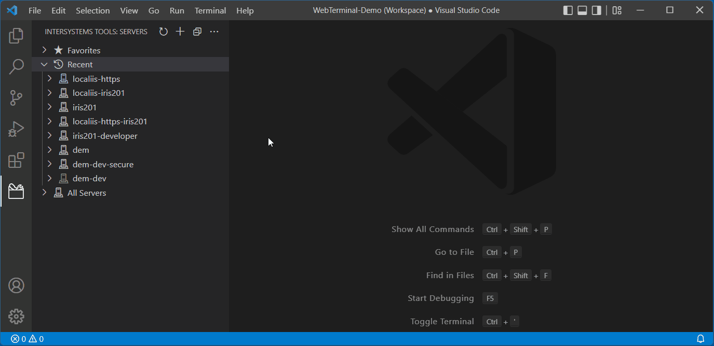

# Launch WebTerminals from InterSystems Server Manager

This extension adds a command button to each entry in the [InterSystems Server Manager](https://marketplace.visualstudio.com/items?itemName=intersystems-community.servermanager) tree. Clicking the button creates a VS Code tab containing a [WebTerminal](https://openexchange.intersystems.com/package/WebTerminal) connected to the chosen server.

The button is also available under the Namespaces tree of each server. Use it there to start your WebTerminal in the chosen namespace. This action also adds the namespace name to the label of the WebTerminal tab.

 If you prefer to open a WebTerminal externally in your default web browser, use the context menu of the server row or namespace row.

 

 > The extension is competing in the [InterSystems Grand Prix 2022](https://openexchange.intersystems.com/contest/23) programming contest. Voting period: May 30 - June 5, 2022. If you like it please vote for it.

## Installation

The extension is published on [Marketplace](https://marketplace.visualstudio.com/items?itemName=georgejames.webterminal-vscode). Either install it from there, or search for its identifier `georgejames.webterminal-vscode` in the Extensions view of [VS Code](https://code.visualstudio.com/Download).

This extension depends on the InterSystems Server Manager extension, and will install it automatically if necessary.

WebTerminal must already be installed on the target InterSystems servers. See [here](https://intersystems-community.github.io/webterminal/#downloads) for instructions. The current WebTerminal version (4.9.3) is documented as working on versions from 2014.1 upward.

If you only want to open WebTerminals in your browser using the context menu (see above), no further setup is required.

To launch them in VS Code tabs do the following:

> This procedure has been verified with:
> - IRIS 2020.1.1 and IIS 10.0 web server
> - IRIS 2021.1.2 and Apache 2.4.29
> 
> Correct operation on other products and versions remains unproven.

1. In Portal's System Administration > Security > Applications > Web Applications page, create a new entry copied from `/terminal`. Name the copy `/terminal-vscode`. Suggested description is `Copy of /terminal for use by georgejames.webterminal-vscode extension`
2. Set the `Session Cookie Scope` of the new `/terminal-vscode` application to the value `None`.
3. Configure a web server to use [InterSystems Web Gateway](https://docs.intersystems.com/iris20212/csp/docbook/DocBook.UI.Page.cls?KEY=GCGI_intro) so it can serve your web applications securely over `https`. As a minimum it needs to serve the following applications:
   - /api/atelier
   - /terminal
   - /terminal-vscode
   - /terminalsocket
> An open [WebTerminal issue](https://github.com/intersystems-community/webterminal/issues/142) means these have to be served from the root of the web server (e.g. https://myserver.internal/terminal/). If placed under a subfolder (e.g. https://myserver.internal/dev/terminal/) the initial standalone WebTerminal authentication dialog will appear but connection will fail.

4. Configure your Server Manager connection to use this web server. Use a hostname for which the web server's certificate is valid. If the certificate is self-signed or is issued by a CA that your workstation doesn't automatically trust you will also need to do the following sub-steps, otherwise the connection is likely to fail:
   - Be using Server Manager [2.0.10-beta.2](https://github.com/intersystems-community/intersystems-servermanager/releases/download/v2.0.10-beta.2/servermanager-2.0.10-beta.2.vsix) or later.
   - Have the setting `"http.proxyStrictSSL": false` at Workspace or User level.
5. Patch `WebTerminal.Router.cls` in the namespace where you installed WebTerminal, adding these lines and recompiling the class after saving it:
```objectscript
  Parameter HandleCorsRequest = 1;
  Parameter UseSession As BOOLEAN = 1;
```
6. Make sure that the account used by the secure web server's InterSystems Web Gateway (typically `CSPSystem`) has at least **READ** privilege on the security resource which protects WebTerminal's code database.
  
## Release Notes

See the [CHANGELOG](https://marketplace.visualstudio.com/items/georgejames.webterminal-vscode/changelog) for changes in each release.

